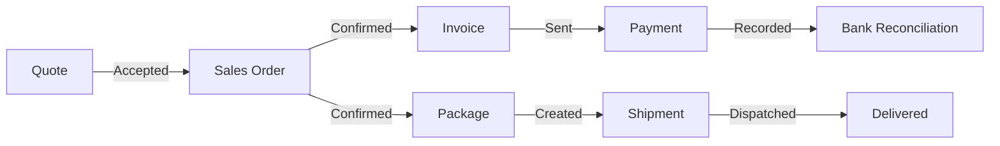
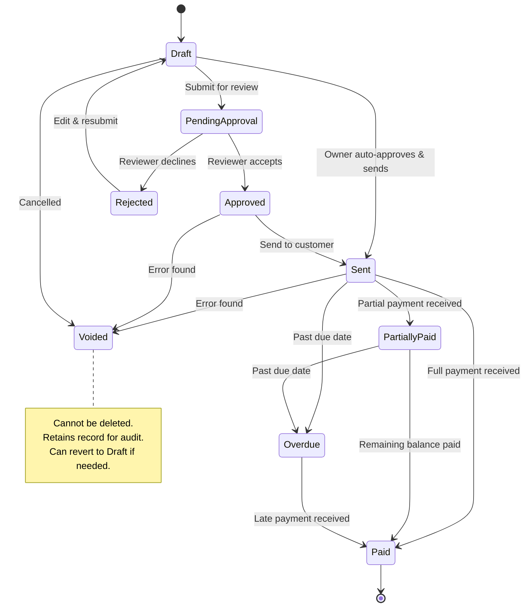
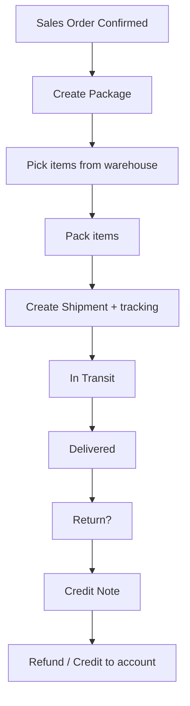

# Zoho Sales & Invoicing Flow — Reference for Zynk

## Overview

Zoho Books + Zoho Inventory together form a complete **Quote → Sales Order → Invoice → Payment → Package → Ship → Deliver** pipeline. This document breaks down every stage, its states, transitions, and business rules so we can model Zynk's sales system after the industry standard.

---

## 1. The Full Sales Lifecycle



### Stage-by-Stage Breakdown

| Stage | Zoho Module | What Happens | Key States |
|-------|-------------|-------------|------------|
| **Quote** | Zoho Books | Sales rep creates a price proposal for the customer | `Draft` → `Sent` → `Accepted` / `Declined` / `Expired` |
| **Sales Order** | Zoho Books | Formalizes the accepted quote with items, qty, delivery terms | `Draft` → `Open` → `Closed` |
| **Invoice** | Zoho Books | Requests payment from customer; created from Sales Order | `Draft` → `Sent` → `Unpaid` → `Partially Paid` → `Paid` / `Overdue` / `Voided` |
| **Payment** | Zoho Books | Records money received against an invoice | Online (auto-recorded) or manual (cash/check/bank transfer) |
| **Package** | Zoho Inventory | Items are picked, packed, and prepared for dispatch | `Not Shipped` → `Shipped` → `Delivered` (can revert to `Undelivered`) |
| **Shipment** | Zoho Inventory | Carrier/tracking info attached to packages | Created manually or via carrier integration |
| **Credit Note** | Zoho Books | Issued when items are returned or service is unsatisfactory | Applied to future invoices or refunded |

---

## 2. Invoice State Machine (Deep Dive)

This is the core of the financial flow:



### Business Rules

| Rule | Detail |
|------|--------|
| **No deletion** | Invoices are **never** deleted. They can only be `Voided`. This preserves the audit trail. |
| **Void preserves data** | A voided invoice remains in the system with all its line items. It can be reverted to `Draft` if the void was a mistake. |
| **Approval gate** | Depending on org settings, invoices may require approval before being sent. Owners can auto-approve. |
| **Partial invoicing** | A Sales Order can be invoiced in parts (e.g., 50% deposit now, 50% on delivery). |
| **Overdue auto-detection** | If an invoice passes its due date without full payment, it automatically moves to `Overdue`. |

---

## 3. Fulfillment / Shipping Flow (Zoho Inventory)

Separate from the financial flow, this tracks the **physical goods**:



### Key Points

- **Stock is only decremented when the package status moves to `Shipped`** — not when the Sales Order is created
- A Sales Order can have **multiple packages** (partial fulfillment)
- **Drop shipping** is supported: SO converts to PO sent to supplier, who ships directly to customer
- Package status can be **reverted** from `Delivered` back to `Shipped` if recorded incorrectly

---

## 4. Returns & Credit Notes

| Scenario | Zoho Process |
|----------|-------------|
| Customer returns items | Credit Note created → linked to original invoice → stock re-added |
| Service was unsatisfactory | Credit Note issued → can apply to future invoices or refund |
| Partial return | Credit Note for specific line items only |
| Exchange | Credit Note + new Sales Order |

---

## 5. How This Maps to Zynk

### What We Need to Build

| Zoho Concept | Zynk Equivalent | Priority |
|-------------|-----------------|----------|
| Quote | **Not needed initially** — most SMEs do direct sales | P3 |
| Sales Order | **Invoice/Sale** — created at POS or manually | P1 |
| Invoice states | **Invoice state machine** (Draft → Approved → Paid → Shipped) | P1 |
| Package & Shipment | **Simplified fulfillment** — single "Shipped" flag per invoice | P2 |
| Payment recording | **Payment model** — linked to invoice, supports partial | P1 |
| Credit Note | **Returns/Credit** — needed for inventory accuracy | P2 |
| Approval workflow | **Role-based approval** — ties into custom roles system | P1 |
| Bank reconciliation | **Future** — integrate with M-Pesa/bank APIs | P3 |

### Zynk's Simplified Invoice States

For an SME-focused POS, we simplify Zoho's states while keeping the important ones:

```
Draft → Pending Approval → Approved → Paid → Shipped → Completed
                    ↓                   ↓
                 Rejected            Voided
```

**Key differences from Zoho:**
- `Completed` = Paid + Shipped + Fulfilled (terminal state)
- No separate `Sent` state (Zynk is in-person POS, not remote invoicing)
- `Shipped` is the moment stock physically leaves (even for walk-in = instant)
- Walk-in POS sales can auto-flow: `Draft → Approved → Paid → Shipped → Completed` in one tap

---

## 6. Payment Methods for Kenya/East Africa

| Method | Integration | Priority |
|--------|------------|----------|
| M-Pesa (Safaricom) | Daraja API / STK Push | P1 |
| Cash | Manual recording | P1 |
| Card (Visa/Mastercard) | Payment terminal integration | P2 |
| Bank Transfer | Manual + reconciliation | P3 |
| Airtel Money | Airtel API | P3 |
| T-Kash (Telkom) | API | P3 |

---

## 7. Tables Needed (Schema Preview)

```sql
-- Core invoice table
invoices (
    id UUID PRIMARY KEY,
    tenant_id UUID NOT NULL,
    branch_id UUID,
    customer_id UUID,
    created_by UUID,           -- staff who created it
    approved_by UUID,          -- staff who approved it
    invoice_number TEXT,       -- auto-generated, sequential
    status TEXT NOT NULL,      -- draft|pending_approval|approved|rejected|paid|partially_paid|shipped|completed|voided
    subtotal REAL,
    tax_amount REAL,
    discount_amount REAL,
    grand_total REAL,
    amount_paid REAL DEFAULT 0,
    notes TEXT,
    due_date TIMESTAMP,
    shipped_at TIMESTAMP,
    completed_at TIMESTAMP,
    voided_at TIMESTAMP,
    void_reason TEXT,
    created_at TIMESTAMP,
    updated_at TIMESTAMP
)

-- Line items
invoice_items (
    id UUID PRIMARY KEY,
    invoice_id UUID NOT NULL,
    product_id UUID NOT NULL,
    quantity INTEGER NOT NULL,
    unit_price REAL NOT NULL,
    discount REAL DEFAULT 0,
    tax_rate REAL DEFAULT 0,
    line_total REAL NOT NULL,
    created_at TIMESTAMP
)

-- Payment records (supports partial payments)
payments (
    id UUID PRIMARY KEY,
    invoice_id UUID NOT NULL,
    amount REAL NOT NULL,
    payment_method TEXT,       -- mpesa|cash|card|bank_transfer
    reference_number TEXT,     -- M-Pesa transaction code, etc.
    recorded_by UUID,
    created_at TIMESTAMP
)
```
